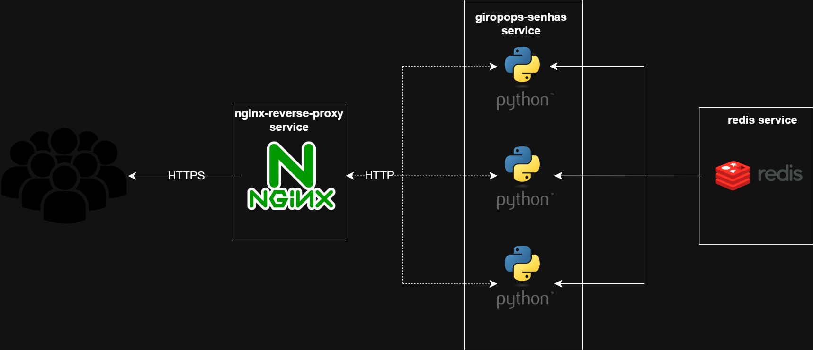

# Giropops Senhas NGINX - Um projeto de estudos de Docker

Este é um projeto de fim de semana para fins de estudo.
A ideia é utilizar a aplicação [giropops-senhas](https://github.com/badtuxx/giropops-senhas) (créditos ao [Jeferson Fernando](https://github.com/badtuxx)), replicando-a em três (ou N) containers e utilizando um container NGINX como proxy reverso, fazendo uma terminação TLS/SSL. O projeto também contem um Redis para armazenar os dados enquanto a aplicação está rodando.



## Objetivos

- Praticar a utilização de multi-stage build e imagens distroless
- Entender o funcionamento de um serviço com múltiplas réplicas provisionado com Docker Compose
- Entender o funcionamento de secrets com Docker Compose
- Revisar o uso de nginx como proxy reverso e terminação TLS/SSL

## Estrutura do repositório

```
.
|——— giropops-senhas/                             -> Código fonte do giropops-senhas e um Dockerfile de imagem distroless e nonroot
|——— nginx/
|    |——— Dockerfile                              -> Dockerfile
|    |——— giropops-senhas-reverse-proxy.template  -> Template de configuração do nginx. Como o nginx não tem suporte nativo de leitura de variáveis de ambiente, o Dockerfile substitui as variáveis indicadas no template pelos seus valores. O
|——— docker-compose.yaml                          -> Realiza a subida dos containers do giropops-senhas, nginx e redis
```

## Requisitos e ambiente de desenvolvimento

Este projeto foi desenvolvido e testado com:

- Ubuntu 24.04.4 LTS
- Docker Engine 29.2.1
- Docker Compose v5.0.2
- Docker Scout v1.19.0

## Como executar

```
export SERVER_CERT_PATH=<path do seu certificado TLS>
export SERVER_KEY_PATH=<path da chave privada TLS>
docker compose up -d
```

## Detalhes da implementação e aprendizados

### Cuidado com a compatibilidade entre as stages em multi-stage build

Em multi-stage builds, é necessário tomar cuidado com a compatibilidade entre as stacks utilizadas no builder e no runner. Por exemplo, na giropops-senhas, o builder e o runner estão utilizando python3.13, o que garante a compatibilidade mesmo que builder e runner estejam em versões de patches diferentes (ex.: 3.13-5 e 3.13-10).
Ainda no giropops-senhas, como não encontrei uma evidência clara de que a imagem runner de tag gcr.io/distroless/python3-debian13:nonroot terá a versão python3.13 em todo seu ciclo de vida, optei por pinar o SHA Digest da imagem diretamente no [Dockerfile da aplicação](giropops-senhas/Dockerfile).

###  Comportamento de um service com mais de uma réplica em redes bridge

Configurei o service giropops-senhas para ter 3 réplicas. Ao subir o compose e observar os logs, reparei que a cada chamada uma réplica diferente respondia, mesmo eu não escrevendo nenhuma configuração para isso. Para verificar este comportamento, subi um debian na rede private-network declarada no [docker-compose.yaml](docker-compose.yaml) e instalei o dns-utils para verificar esta resolução de DNS:

```
docker run -it --rm --network giropops-senhas-nginx_private-network debian:latest
apt update && apt install dnsutils -y
```

Ao executar o dig apontando para o endereço giropops-senhas, esta foi a saída:

```
root@d299401a52b0:/# dig giropops-senhas

; <<>> DiG 9.20.18-1~deb13u1-Debian <<>> giropops-senhas
;; global options: +cmd
;; Got answer:
;; ->>HEADER<<- opcode: QUERY, status: NOERROR, id: 43277
;; flags: qr rd ra; QUERY: 1, ANSWER: 3, AUTHORITY: 0, ADDITIONAL: 0

;; QUESTION SECTION:
;giropops-senhas.               IN      A

;; ANSWER SECTION:
giropops-senhas.        600     IN      A       172.20.0.4
giropops-senhas.        600     IN      A       172.20.0.3
giropops-senhas.        600     IN      A       172.20.0.6

;; Query time: 1 msec
;; SERVER: 127.0.0.11#53(127.0.0.11) (UDP)
;; WHEN: Sun Mar 08 16:16:08 UTC 2026
;; MSG SIZE  rcvd: 126
```

Foi retornado múltiplos registros 'A' para o mesmo DNS. Ao executar novamente (ocultando aqui as outras seções da saída do dig):

```
root@d299401a52b0:/# dig giropops-senhas
...
;; ANSWER SECTION:
giropops-senhas.        600     IN      A       172.20.0.6
giropops-senhas.        600     IN      A       172.20.0.4
giropops-senhas.        600     IN      A       172.20.0.3
...
```

Observe que a ordem dos IPs rotacionou, o que explica porque as chamadas do cliente não são sempre encaminhadas para a mesma réplica do serviço. Pesquisando sobre este comportamento, entendi que o DNS interno do docker está executando o chamado [DNS Round Robin](https://www.cloudflare.com/pt-br/learning/dns/glossary/round-robin-dns/). Esta é uma conclusão interessante, já que possibilita que serviços com múltiplas réplicas tenham um mecanismo de load balancer em sua frente, distribuindo a carga para todas as réplicas.

### Utilização de imagem distroless do NGINX

Por boa prática, ao invés de inserir o endereço e porta do service giropops-senhas de forma hard-coded no arquivo de configuração do NGINX, eu optei por utilizar variáveis de ambiente declaradas no [docker-compose.yaml](docker-compose.yaml). O NGINX não possui suporte nativo a variáveis de ambiente, portanto precisei criar um pequeno script para substituir os valores das variáveis no [template de configuração](nginx/giropops-senhas-reverse-proxy.template) e copiar o resultado para o diretório /etc/nginx/conf.d/. Eu adicionei este script diretamente no entrypoint da imagem do NGINX, adicionando também o comando para iniciar a execução do NGINX.
Além disso, para passar o par certificado-chave TLS para o container, optei por utilizar as [secrets](https://docs.docker.com/compose/how-tos/use-secrets/) do Docker Compose. As secrets basicamente são montadas como arquivos no container em /run/secrets/. Este path é referenciado na configuração TLS do [template](nginx/giropops-senhas-reverse-proxy.template).
Utilizando a imagem nginx:1.29.5-alpine3.23-slim do DockerHub, funcionou perfeitamente.

Em seguida, optei por utilizar uma imagem distroless. A imagem escolhida foi do próprio DockerHub: uma DHI ([Docker Hardened Images](https://hub.docker.com/hardened-images/catalog)), mais espcificamente: [dhi.io/nginx:1.29.5-debian13](https://hub.docker.com/hardened-images/catalog/dhi/nginx). Esta imagem não possui nenhum shell, o que impossibilita a utilização do script das variáveis de ambiente no entrypoint da imagem. A solução pensada foi utilizar a estratégia de multi-stage build no Dockerfile, executando a substituição das variáveis de ambiente no primeiro estágio e copiando o arquivo resultante para o /etc/nginx/conf.d/. Ao fazer o build e executar o compose, o container do NGINX não se mantinha de pé. Observando os logs:

```
nginx-reverse-proxy-1  | 2026/03/08 22:48:30 [emerg] 1#1: cannot load certificate "/tls-certificate": BIO_new_file() failed (SSL: error:8000000D:system library::Permission denied:calling fopen(/tls-certificate, r) error:10080002:BIO routines::system lib)
nginx-reverse-proxy-1  | nginx: [emerg] cannot load certificate "/tls-certificate": BIO_new_file() failed (SSL: error:8000000D:system library::Permission denied:calling fopen(/tls-certificate, r) error:10080002:BIO routines::system lib)
```

O usuário que executa o processo não possui privilégios para ler o par certificado-chave do TLS. Ao verificar mais detalhadamente a [documentação da imagem](https://hub.docker.com/hardened-images/catalog/dhi/nginx/guides), observa-se que ela não possui usuário root. Provavelmente as secrets declaradas nos services do docker-compose.yaml são passadas para o container com o root como owner, apesar de eu não ter encontrado nenhuma documentação oficial sobre isso. Após uma pesquisa na documentação do docker compose, verifiquei que existem também as [secrets a nível de build](https://docs.docker.com/reference/compose-file/build/#secrets), que podem ser [utilizadas em tempo de build](https://docs.docker.com/build/building/secrets/#secret-mounts). O primeiro estágio do build pode ler as secrets e copiá-las para um diretório persistente, já o segundo estágio pode copiá-las para a imagem final, configurando o usuário do NGINX como owner. Ao testar a solução, novamente o container não se mantinha de pé:

```
nginx-reverse-proxy-1  | 2026/03/08 22:07:15 [emerg] 1#1: invalid port in upstream ":" in /etc/nginx/conf.d/giropops-senhas-reverse-proxy.conf:13
nginx-reverse-proxy-1  | nginx: [emerg] invalid port in upstream ":" in /etc/nginx/conf.d/giropops-senhas-reverse-proxy.conf:13
```

Desta vez, o erro mudou. Uma boa notícia já que aparentemente o problema de leitura da secret foi resolvido.

Sobre este erro, suspeitei que as variáveis de ambiente estavam sendo substituídas por strings vazias no arquivo de configuração. Após algum tempo batendo cabeça nisso, descobri que variáveis de ambiente declaradas no docker-compose.yaml só existem em tempo de execução do container e não durante o tempo de build. Com a imagem não-distroless que usei antes, o script de substituição era executado no entrypoint, ou seja, no momento em que o container começava a ser executado e as variáveis já existiam. Com a imagem distroless e build multi-stage, o script precisava ser executado em tempo de build, portanto as variáveis de ambiente ainda não existiam e não poderiam ser utilizadas. O docker compose não fornece uma maneira de declarar variáveis de ambiente que existem em tempo de build, portanto a solução foi declarar as variáveis diretamente no Dockerfile, passando seus valores via args. Os valores dos args são preenchidos no [docker-compose.yaml](docker-compose.yaml). Ao testar a solução:

```
nginx-reverse-proxy-1  | 2026/03/09 14:10:42 [notice] 1#1: using the "epoll" event method
nginx-reverse-proxy-1  | 2026/03/09 14:10:42 [notice] 1#1: nginx/1.29.5
nginx-reverse-proxy-1  | 2026/03/09 14:10:42 [notice] 1#1: built by gcc 14.2.0 (Debian 14.2.0-19) 
nginx-reverse-proxy-1  | 2026/03/09 14:10:42 [notice] 1#1: OS: Linux 6.8.0-101-generic
nginx-reverse-proxy-1  | 2026/03/09 14:10:42 [notice] 1#1: getrlimit(RLIMIT_NOFILE): 1048576:1048576
nginx-reverse-proxy-1  | 2026/03/09 14:10:42 [notice] 1#1: start worker processes
nginx-reverse-proxy-1  | 2026/03/09 14:10:42 [notice] 1#1: start worker process 7
nginx-reverse-proxy-1  | 2026/03/09 14:10:42 [notice] 1#1: start worker process 8
```

Temos um container nginx distroless funcionando!! Todas as considerações acima resultaram neste [Dockerfile](nginx/Dockerfile).

### Tempo de build das imagens

Agora que os três serviços estão utilizando imagens distroless, é possível analisar o tempo de build total da solução. Para garantir que não haveria nenhum cache ou nenhuma reutilização durante os processo de build, foram excluídas todas as imagens do host 0(`docker image prune --all --force`) e todo o cache (`docker builder prune --all --force`). Para realizar o build, utilizei o `docker compose build <service> --no-cache`. Os tempos de build obtidos foram os seguintes:

#### giropops-senhas

```
[+] build 1/1
 ✔ Image giropops-senhas-nginx-giropops-senhas      28.3s
```

#### nginx-reverse-proxy

```
[+] build 1/1
 ✔ Image giropops-senhas-nginx-nginx-reverse-proxy  16.5s
```

Como a imagem do redis não foi customizada, não há build dela, apenas o download da imagem.

### Tamanho final das imagens

```
IMAGE                                              ID             DISK USAGE   CONTENT SIZE   EXTRA
dhi.io/redis:8.6.1-debian13                        d4c72b1df1eb       79.1MB         18.8MB    U   
giropops-senhas-nginx-giropops-senhas:latest       e3aaeae7123f         96MB         23.9MB    U   
giropops-senhas-nginx-nginx-reverse-proxy:latest   35bb711ef957       53.5MB         11.8MB    U   
```

### Vulnerabilidades das imagens

Aqui, foi utilizado o docker scout. Algumas saídas foram ocultadas:

#### giropops-senhas

```                                         
## Packages and Vulnerabilities

   0C     0H     0M     1L  flask 3.0.3
pkg:pypi/flask@3.0.3

    ✗ LOW CVE-2026-27205 [Use of Cache Containing Sensitive Information]
      https://scout.docker.com/v/CVE-2026-27205
      Affected range : <3.1.3                                                          
      Fixed version  : 3.1.3                                                           
      CVSS Score     : 2.3                                                             
      CVSS Vector    : CVSS:4.0/AV:N/AC:L/AT:P/PR:N/UI:P/VC:L/VI:N/VA:N/SC:N/SI:N/SA:N 
    


1 vulnerability found in 1 package
  CRITICAL  0 
  HIGH      0 
  MEDIUM    0 
  LOW       1 
```

Basta alterar a versão do flask para 3.1.3 em [requirements.txt](giropops-senhas/requirements.txt) que a vulnerabilidade registrada será removida.

#### nginx-reverse-proxy

```
## Packages and Vulnerabilities

   0C     0H     0M     7L  glibc 2.41-12+deb13u1
pkg:deb/debian/glibc@2.41-12%2Bdeb13u1?os_distro=trixie&os_name=debian&os_version=13

   0C     0H     0M     4L  systemd 257.9-1~deb13u1
pkg:deb/debian/systemd@257.9-1~deb13u1?os_distro=trixie&os_name=debian&os_version=13

   0C     0H     0M     2L  coreutils 9.7-3
pkg:deb/debian/coreutils@9.7-3?os_distro=trixie&os_name=debian&os_version=13

   0C     0H     0M     1L  openssl 3.5.4-1~deb13u2
pkg:deb/debian/openssl@3.5.4-1~deb13u2?os_distro=trixie&os_name=debian&os_version=13

14 vulnerabilities found in 4 packages
  CRITICAL  0  
  HIGH      0  
  MEDIUM    0  
  LOW       14
```

Nenhuma atualização destes pacotes resolve os CVEs até o momento

#### redis

```
## Packages and Vulnerabilities

  No vulnerable packages detected
```

Aqui, não há nenhuma vulnerabilidade registrada.